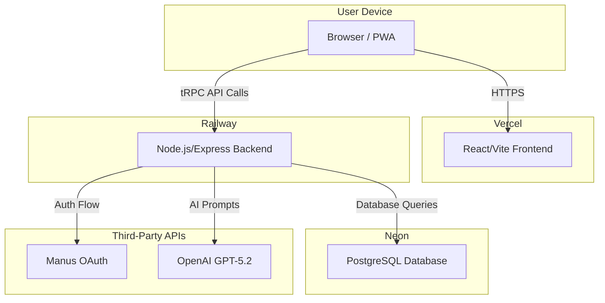

# A.Cosmos - AI-Guided Self-Reflection Platform


**Illuminate the stars within you.** A.Cosmos is a web and Progressive Web App (PWA) designed for meaningful, guided conversations with AI guardians. It provides a safe, private space for self-reflection, personal insight, and life exploration.

This repository contains the complete source code for the A.Cosmos platform.

---

## Features

*   **Full-Stack Application**: Modern, robust, and scalable architecture using React/Vite for the frontend and Express/tRPC for the backend.
*   **AI Guardian Coaches**: Engage in deep conversations with four distinct AI coaches (Andy, Anya, Alma, Axel), each powered by OpenAI's GPT-5.2 for nuanced and insightful dialogue.
*   **Progressive Web App (PWA)**: Install A.Cosmos on your mobile or desktop device for a native-app-like experience, including offline access and push notifications.
*   **Persistent Data**: User accounts, conversation history, and reflections are securely stored in a PostgreSQL database (Neon Serverless), managed by the Drizzle ORM.
*   **Secure Authentication**: User authentication is handled via a secure OAuth 2.0 flow, ensuring user data privacy.
*   **Usage & Admin Dashboards**: Built-in dashboards for monitoring application usage and managing users.
*   **Cosmic-Themed UI**: An immersive, beautiful user interface built with TailwindCSS, designed to foster a sense of calm and introspection.

## Technical Architecture

The A.Cosmos platform is designed with a decoupled frontend and backend, deployed on modern PaaS providers for high availability and low maintenance.



*   **Frontend**: Hosted on **Vercel** for optimal performance and global CDN distribution.
*   **Backend**: Hosted on **Railway** for simplified management and pay-as-you-go scaling.
*   **Database**: Hosted on **Neon** for serverless PostgreSQL with automatic scaling and generous free tier.
*   **External APIs**: Integrates with **Manus OAuth** for authentication and **OpenAI** for advanced AI capabilities.

## Technology Stack

*   **Frontend**: React, Vite, TypeScript, TailwindCSS, tRPC Client, Wouter
*   **Backend**: Node.js, Express, TypeScript, tRPC Server
*   **Database**: PostgreSQL (Neon Serverless), Drizzle ORM
*   **Deployment**: Vercel (Frontend), Railway (Backend), Neon (Database)
*   **Package Manager**: pnpm

## Project Structure

```
/acosmos-app
├── client/         # React/Vite frontend source code
│   ├── public/     # Static assets (icons, manifest.json)
│   └── src/        # Frontend components, pages, hooks, etc.
├── server/         # Node.js/Express backend source code
│   ├── _core/      # Core server setup (Express, tRPC, Auth)
│   └── routers.ts  # tRPC API endpoint definitions
├── drizzle/        # Database schema and migration files
│   └── schema.ts   # Drizzle ORM schema definitions (PostgreSQL)
├── shared/         # Code shared between client and server
│   └── types.ts    # Shared TypeScript types
├── prompts/        # Prompt engineering files for AI coaches
├── .env.example    # Environment variable template
├── package.json    # Project dependencies and scripts
└── README.md       # This file
```

## Getting Started (Local Development)

Follow these steps to set up and run the project on your local machine.

### Prerequisites

*   [Node.js](https://nodejs.org/en/) (v18 or later)
*   [pnpm](https://pnpm.io/installation)

### 1. Clone the Repository

```bash
git clone https://github.com/sherryzhanglx-design/acosmos-app.git
cd acosmos-app
```

### 2. Install Dependencies

```bash
pnpm install
```

### 3. Set Up Environment Variables

Copy the environment variable template and fill in the required values.

```bash
cp .env.example .env
```

Now, open the `.env` file and provide the necessary credentials for your Neon database, auth provider, and OpenAI.

### 4. Set Up Database

This project uses Drizzle ORM with Neon PostgreSQL. To apply the schema to your database, run:

```bash
pnpm run db:push
```

### 5. Start the Development Server

This command will start the backend server and the frontend development server concurrently.

```bash
pnpm run dev
```

The application should now be running on `http://localhost:3000` (or the next available port).

## Deployment

This project is set up for automated CI/CD (Continuous Integration/Continuous Deployment) via Vercel, Railway, and Neon.

1.  **Vercel (Frontend)**: Connect your GitHub repository to a new Vercel project. Vercel will automatically detect the Vite configuration and set up the build process. Link the `A.cosmos.app` domain here.
2.  **Railway (Backend)**: Connect the same GitHub repository to a new Railway project. Create a Node.js service. Railway will use the `pnpm run build` and `pnpm start` commands to deploy the backend. Set the required environment variables (including the Neon `DATABASE_URL`) in the Railway service configuration.
3.  **Neon (Database)**: Create a free PostgreSQL database on Neon. Copy the connection string and set it as the `DATABASE_URL` environment variable in Railway. Run `pnpm run db:push` to initialize the schema.

Once connected, any push to the `main` branch will automatically trigger a new deployment on both Vercel and Railway.

## Available Scripts

*   `pnpm dev`: Starts the development server for both frontend and backend.
*   `pnpm build`: Builds the frontend and backend for production.
*   `pnpm start`: Starts the production server (requires a prior build).
*   `pnpm test`: Runs the test suite using Vitest.
*   `pnpm db:push`: Pushes the Drizzle schema to the database.
*   `pnpm format`: Formats the code using Prettier.
